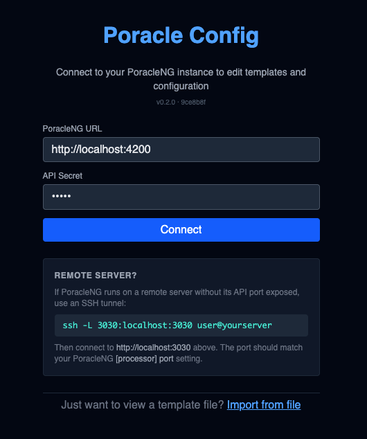
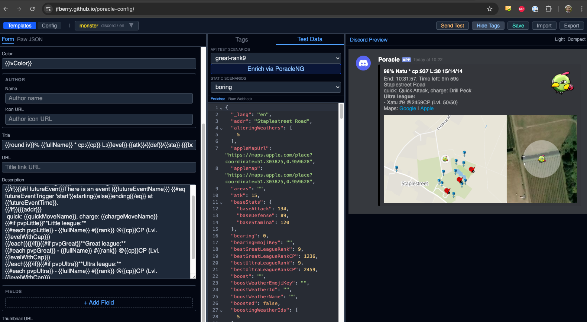

# Poracle Config UI

The **[Poracle Config UI](https://jfberry.github.io/poracle-config/)** is a web-based editor for PoracleNG's configuration and DTS templates. It runs entirely in your browser as a static site hosted on GitHub Pages and connects directly to your PoracleNG instance over its HTTP API — there is nothing to install on the server.

!!! warning "Beta"
    The Config UI is currently in beta. It's a useful alternative to hand-editing `config.toml` and `dts.json`, but always keep a backup of your config files before saving changes. If you hit a bug, report it on the [poracle-config repository](https://github.com/jfberry/poracle-config).

## What it does

- **Edit `config.toml`** through typed form fields with inline validation, instead of hand-writing TOML
- **Edit DTS templates** with a form-based field editor, a live Discord preview pane, and test webhook data you can pipe through the template to see the rendered output
- **Import / view template files offline** without connecting to PoracleNG — useful for reading a community-shared template before deciding whether to install it

## Prerequisites

PoracleNG must be running with `api_secret` set in `[processor]`:

```toml
[processor]
host = "0.0.0.0"
port = 3030
api_secret = "a-long-random-string"
```

Your browser must be able to reach the processor's `host:port` directly. If PoracleNG runs on a remote server where the API port isn't exposed publicly, use an SSH tunnel (see below).

## Connecting

Open <https://jfberry.github.io/poracle-config/> in your browser.

{ width=420 }

Enter:

| Field | Value |
|---|---|
| **PoracleNG URL** | The full URL of the processor's API, e.g. `http://localhost:3030` |
| **API Secret** | The `api_secret` value from `[processor]` in `config.toml` |

Click **Connect**. The UI sends authenticated requests using the `X-Poracle-Secret` header and fetches your current config and DTS templates.

### Remote servers

If PoracleNG is on a remote host and you don't want to expose its API port, forward it over SSH:

```sh
ssh -L 3030:localhost:3030 user@yourserver
```

Then use `http://localhost:3030` in the Config UI. The local port you forward to must match the `[processor] port` value (default `3030`).

!!! note "Don't expose the API publicly unless you mean to"
    The API serves all of your PoracleNG configuration and tracking data behind the `api_secret`. Prefer an SSH tunnel, VPN, or an IP allow-list on your reverse proxy. Setting `[processor] host = "0.0.0.0"` alone binds the port to every interface.

### View a template file without connecting

The **Import from file** link at the bottom of the connect screen opens a template in read-only/edit mode without touching a live PoracleNG. This is the quickest way to inspect a community-shared `dts.json` before installing it.

## The DTS editor



The DTS editor is split into three panes:

| Pane | Purpose |
|---|---|
| **Left — fields** | Form-based editor for the currently selected template. Each embed/webhook field has its own row with Handlebars syntax highlighted. Use **+ Add Field** to add optional fields to a template. |
| **Middle — test data** | Pick a test payload from the `testdata.json` catalog, or use a tag (e.g. `great-raid`, `boring`) to filter to a relevant sample. The raw JSON of the selected payload is shown below. |
| **Right — Discord preview** | Live render of the template using the selected test data, laid out how the message will look in Discord. Telegram previews are also supported. |

Top-right actions:

- **Send Test** — sends the rendered message to your Discord/Telegram (via PoracleNG) so you can verify the real output in your destination channel, not just in the preview
- **Save** — writes the edited template back to PoracleNG (`config/dts.json`)
- **Import** — load a template from a file on disk (merge or replace existing)

!!! tip "See the full DTS reference"
    The Config UI helps you edit templates, but it doesn't replace the field reference. See [Alert Templates (DTS)](dts.md) for how DTS templates work and what fields are available in each webhook type, and [Advanced DTS](dtsadvanced.md) for partials, per-platform overrides, and helpers.

## The config editor

Switch to the **Config** tab (top of the left pane) to edit `config.toml` instead of templates. Each `[section]` becomes a form group with typed inputs, defaults shown, and links into this documentation. Save writes the changes back to PoracleNG.

## Config UI vs end-user web UIs

The Config UI is an admin tool. It doesn't overlap with the end-user web UIs:

| Tool | Audience | Purpose |
|---|---|---|
| **Poracle Config UI** (this page) | Operators / admins | Edit `config.toml` and DTS templates |
| [**PoracleWeb / PoracleWeb.NET**](../poracleWeb/index.md) | End users | Manage personal tracking subscriptions (pokemon, raids, areas, profiles) without using bot commands |

All three connect to the same PoracleNG API on port 3030 using the same `api_secret`, but they manage different parts of the system. You can run them side by side.
