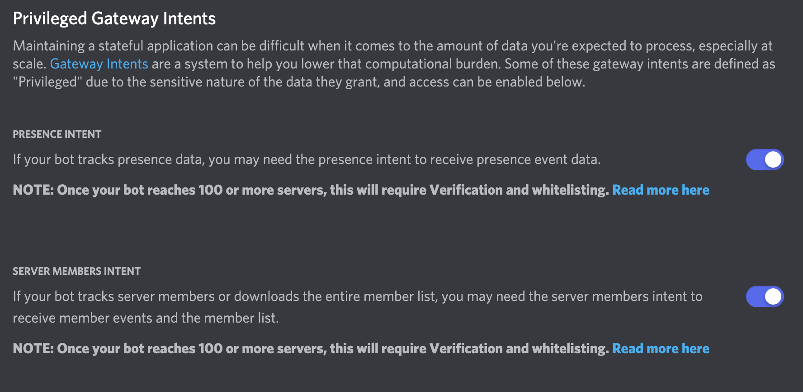
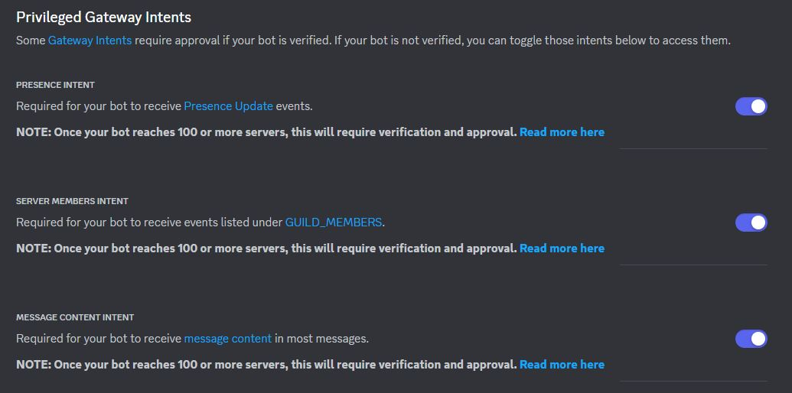

# Discord Bot Setup

To use PoracleNG with Discord, you need to create a Discord bot application and invite it to your server.

## Step 1: Create a Discord Application

1. Go to the [Discord Developer Portal](https://discord.com/developers/applications)
2. Click **New Application**
3. Give it a name (e.g. "Poracle") and click **Create**

## Step 2: Create the Bot

1. In your application, go to the **Bot** section in the left sidebar
2. Click **Add Bot** and confirm
3. Under the bot's username, click **Copy** to copy the bot token

!!! danger "Keep Your Token Secret"
    Never share your bot token publicly. Anyone with the token can control your bot.

## Step 3: Configure Bot Settings

In the Bot settings page:

1. **Public Bot** — disable this so only you can add the bot to servers
2. **Privileged Gateway Intents** — enable the following:
    - **Server Members Intent** — required for role checking and user management
    - **Message Content Intent** — required for reading commands





!!! warning
    The bot will not function correctly without these intents enabled.

## Step 4: Invite the Bot to Your Server

1. Go to the **OAuth2** section, then **URL Generator**
2. Under **Scopes**, select:
    - `bot`
    - `applications.commands`
3. Under **Bot Permissions**, select:
    - Send Messages
    - Manage Messages
    - Embed Links
    - Attach Files
    - Read Message History
    - Use External Emojis
    - Add Reactions
    - Manage Roles (if using role subscriptions)
4. Copy the generated URL and open it in your browser
5. Select your server and authorize

## Step 5: Get Your IDs

You'll need several Discord IDs for configuration. Enable Developer Mode in Discord:

**Settings → Advanced → Developer Mode → Enable**

Then right-click to copy IDs:

- **Guild (Server) ID** — right-click your server name → Copy Server ID
- **Channel ID** — right-click the registration channel → Copy Channel ID
- **Your User ID** — right-click your username → Copy User ID
- **Role IDs** — Server Settings → Roles → right-click a role → Copy Role ID

## Step 6: Configure PoracleNG

Add the bot token and IDs to your `config/config.toml`:

```toml
[discord]
enabled = true
token = ["your-bot-token-here"]
guilds = ["your-guild-id"]
channels = ["registration-channel-id"]
admins = ["your-user-id"]
```

For more Discord configuration options, see [Discord Configuration](../configuration/discord.md).

## Multiple Bots

PoracleNG supports multiple Discord bot tokens for sending messages. The first token is used as the command controller; additional tokens are workers for sending alerts:

```toml
[discord]
token = ["main-bot-token", "worker-bot-token-1", "worker-bot-token-2"]
```

Each worker bot must also be invited to your server with the same permissions.
